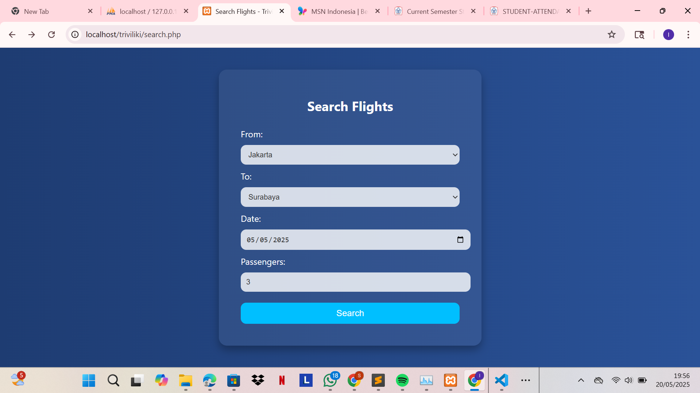
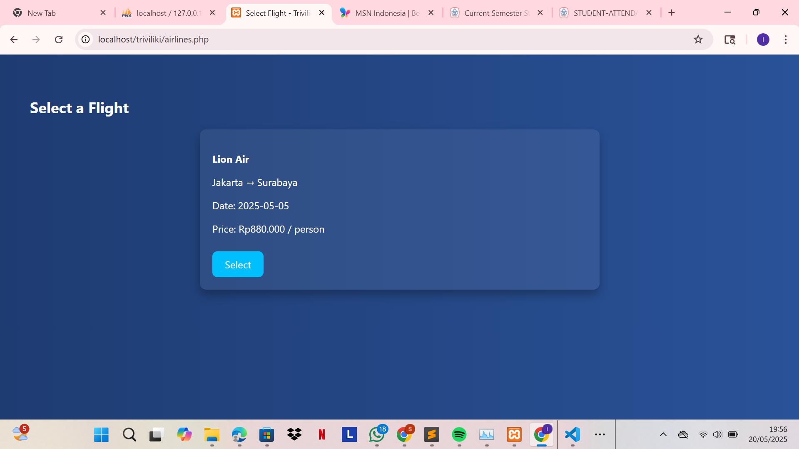
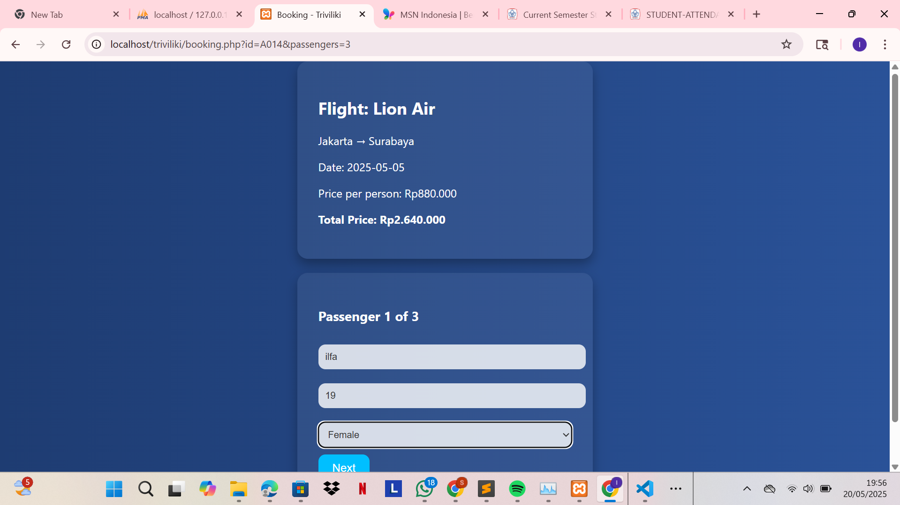
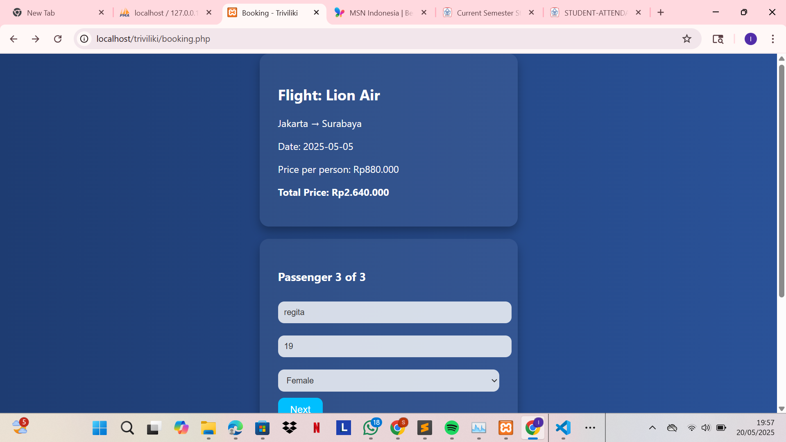
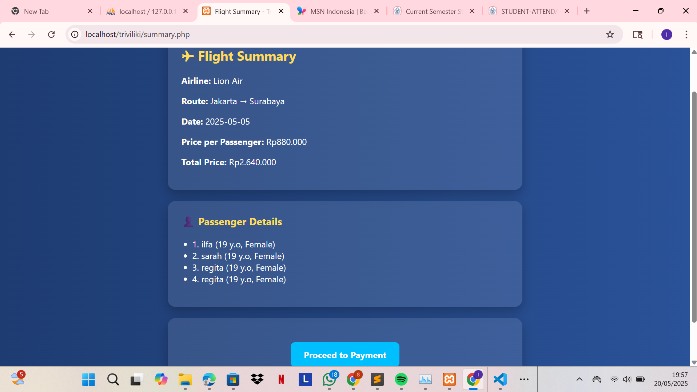
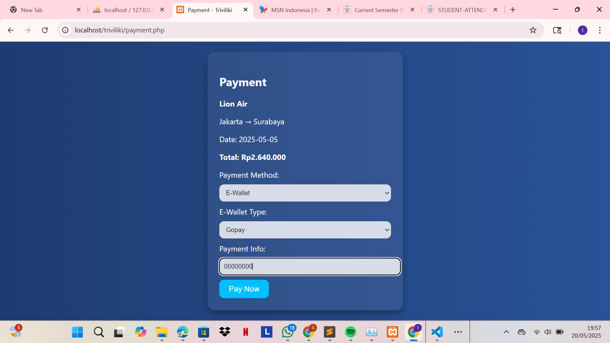
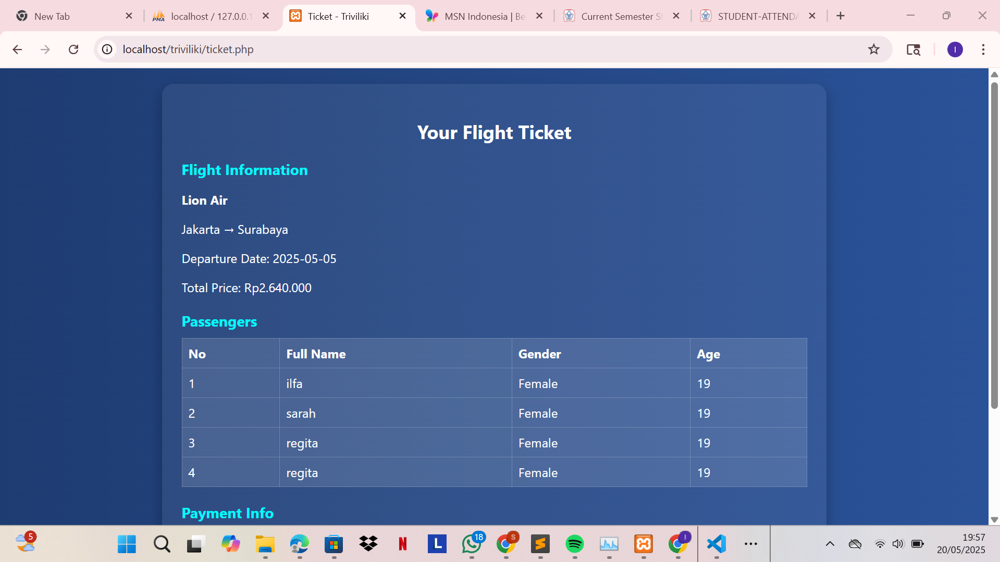
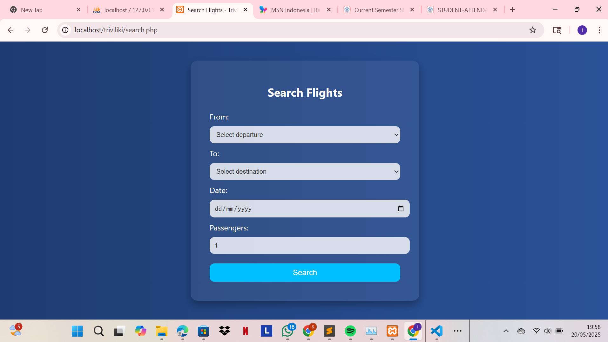
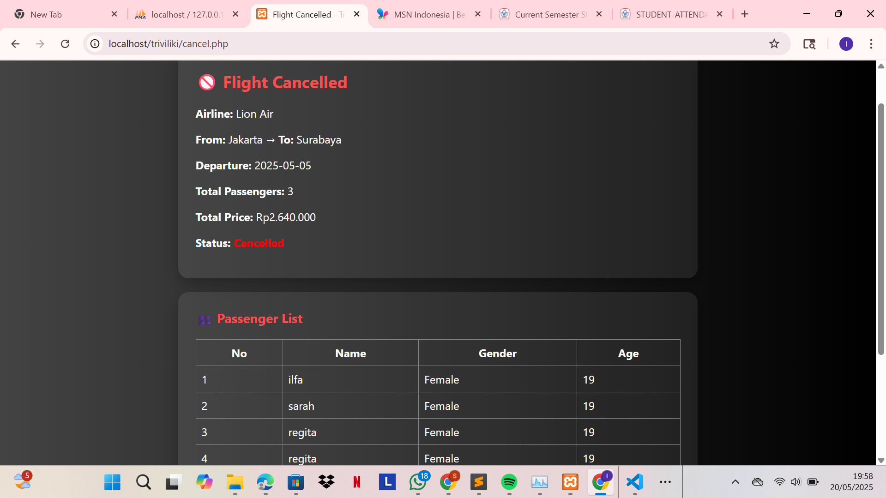

Source Code Explanation  

3.1 `db.php`  
This file handles the database connection using MySQLi.  
```php
<?php
$host = "localhost";
$user = "root";
$password = "";
$database = "triviliki";

$conn = mysqli_connect($host, $user, $password, $database);

if (!$conn) {
    die("Connection failed: " . mysqli_connect_error());
}
?>

### 3.2 login_page.php

This file User login page for accessing the system.
```php
<?php
session_start();
include 'db.php';

$error = '';

if ($_SERVER["REQUEST_METHOD"] == "POST") {
    $email = $_POST["email"];
    $password = $_POST["password"];

    if (!empty($email) && !empty($password)) {
        $stmt = $conn->prepare("SELECT * FROM users WHERE email = ? AND password = ?");
        $stmt->bind_param("ss", $email, $password);
        $stmt->execute();
        $result = $stmt->get_result();

        if ($result->num_rows == 1) {
            $_SESSION["user"] = $email;
            header("Location: search.php");
            exit();
        } else {
            $error = "Invalid email or password.";
        }
    } else {
        $error = "Please enter both email and password.";
    }
}
?>

<!DOCTYPE html>
<html>
<head>
    <title>Login - Triviliki</title>
    <style>
        body {
            font-family: 'Segoe UI', sans-serif;
            background: linear-gradient(to right, #1e3c72, #2a5298);
            color: #fff;
            display: flex;
            align-items: center;
            justify-content: center;
            height: 100vh;
            margin: 0;
        }
        .login-container {
            background: #ffffff10;
            padding: 30px 40px;
            border-radius: 15px;
            box-shadow: 0 8px 16px rgba(0,0,0,0.3);
            text-align: center;
            width: 350px;
        }
        .login-container h2 {
            margin-bottom: 25px;
            color: #fff;
        }
        input[type="email"], input[type="password"] {
            width: 100%;
            padding: 10px 15px;
            margin: 10px 0;
            border: none;
            border-radius: 10px;
            background: #ffffffcc;
            color: #333;
        }
        input[type="submit"] {
            background-color: #00bfff;
            border: none;
            padding: 10px 20px;
            border-radius: 10px;
            color: white;
            cursor: pointer;
            font-size: 16px;
            transition: 0.3s ease;
        }
        input[type="submit"]:hover {
            background-color: #009acd;
        }
        .error {
            color: #ff4c4c;
            margin-bottom: 15px;
        }
    </style>
</head>
<body>
    <div class="login-container">
        <h2>Login to Triviliki</h2>
        <?php if ($error): ?>
            <p class="error"><?php echo $error; ?></p>
        <?php endif; ?>
        <form method="post">
            <input type="email" name="email" placeholder="Email" required>
            <input type="password" name="password" placeholder="Password" required>
            <input type="submit" value="Login">
        </form>
    </div>
</body>
</html>


### 3.3 `search.php`

This file Enables users to search for available flights.
```php
<?php
session_start();
if (!isset($_SESSION["user"])) {
    header("Location: login.php");
    exit();
}

if ($_SERVER["REQUEST_METHOD"] == "POST") {
    $_SESSION['search_from'] = $_POST['from'];
    $_SESSION['search_to'] = $_POST['to'];
    $_SESSION['search_date'] = $_POST['date'];
    $_SESSION['search_passengers'] = $_POST['passengers'];

    header("Location: airlines.php");
    exit();
}
?>

<!DOCTYPE html>
<html>
<head>
    <title>Search Flights - Triviliki</title>
    <style>
        body {
            font-family: 'Segoe UI', sans-serif;
            background: linear-gradient(to right, #1e3c72, #2a5298);
            color: #fff;
            display: flex;
            justify-content: center;
            align-items: center;
            height: 100vh;
            margin: 0;
        }
        .search-container {
            background: #ffffff10;
            padding: 30px 40px;
            border-radius: 15px;
            box-shadow: 0 8px 16px rgba(0,0,0,0.3);
            width: 400px;
        }
        .search-container h2 {
            margin-bottom: 25px;
            text-align: center;
        }
        input, select {
            width: 100%;
            padding: 10px 10px;
            margin: 10px 0;
            border: none;
            border-radius: 10px;
            background: #ffffffcc;
            color: #333;
        }
        input[type="submit"] {
            background-color: #00bfff;
            color: white;
            cursor: pointer;
            font-size: 16px;
            transition: 0.3s ease;
        }
        input[type="submit"]:hover {
            background-color: #009acd;
        }
    </style>
</head>
<body>
    <div class="search-container">
        <h2>Search Flights</h2>
        <form method="POST" action="search.php">
            <label for="from">From:</label>
            <select name="from" required>
                <option value="">Select departure</option>
                <option value="Jakarta">Jakarta</option>
                <option value="Surabaya">Surabaya</option>
                <option value="Medan">Medan</option>
                <option value="Bali">Bali</option>
                <option value="Makassar">Makassar</option>
            </select>

            <label for="to">To:</label>
            <select name="to" required>
                <option value="">Select destination</option>
                <option value="Jakarta">Jakarta</option>
                <option value="Surabaya">Surabaya</option>
                <option value="Medan">Medan</option>
                <option value="Bali">Bali</option>
                <option value="Makassar">Makassar</option>
            </select>

            <label for="date">Date:</label>
            <input type="date" name="date" required>

            <label for="passengers">Passengers:</label>
            <input type="number" name="passengers" min="1" max="10" value="1" required>

            <input type="submit" value="Search">
        </form>
    </div>
</body>
</html>


### 3.4 `airlines.php`


This file to displays or manages airline data.
```php
<?php
if (session_status() === PHP_SESSION_NONE) {
    session_start();
}

include 'db.php';

if (!isset($_SESSION["user"])) {
    header("Location: login.php");
    exit();
}

if (!isset($_SESSION['search_from']) || !isset($_SESSION['search_to']) || !isset($_SESSION['search_date'])) {
    header("Location: search.php");
    exit();
}

$from = $_SESSION['search_from'];
$to = $_SESSION['search_to'];
$date = $_SESSION['search_date'];
$passengers = $_SESSION['search_passengers'];

$stmt = $conn->prepare("SELECT * FROM airlines WHERE from_location=? AND to_location=? AND departure_date=?");
$stmt->bind_param("sss", $from, $to, $date);
$stmt->execute();
$result = $stmt->get_result();
?>

<!DOCTYPE html>
<html>
<head>
    <title>Select Flight - Triviliki</title>
    <style>
        body {
            font-family: 'Segoe UI', sans-serif;
            background: linear-gradient(to right, #1e3c72, #2a5298);
            color: #fff;
            padding: 40px;
        }
        .flight-box {
            background: #ffffff10;
            padding: 20px;
            margin: 15px auto;
            border-radius: 10px;
            max-width: 600px;
            box-shadow: 0 8px 16px rgba(0,0,0,0.3);
        }
        .select-btn {
            display: inline-block;
            padding: 10px 20px;
            background-color: #00bfff;
            color: white;
            border: none;
            border-radius: 8px;
            text-decoration: none;
            margin-top: 10px;
        }
        .select-btn:hover {
            background-color: #009acd;
        }
    </style>
</head>
<body>
    <h2>Select a Flight</h2>

    <?php if ($result->num_rows > 0): ?>
        <?php while ($row = $result->fetch_assoc()): ?>
            <div class="flight-box">
                <p><strong><?php echo $row['airline_name']; ?></strong></p>
                <p><?php echo $row['from_location']; ?> → <?php echo $row['to_location']; ?></p>
                <p>Date: <?php echo $row['departure_date']; ?></p>
                <p>Price: Rp<?php echo number_format($row['price'], 0, ',', '.'); ?> / person</p>
                <a class="select-btn" href="booking.php?id=<?php echo $row['id']; ?>&passengers=<?php echo $passengers; ?>">Select</a>
            </div>
        <?php endwhile; ?>
    <?php else: ?>
        <p>No flights found for your search.</p>
    <?php endif; ?>
</body>
</html>


### 3.5 `booking.php`




This file to handles the ticket booking process
```php
<?php
if (session_status() === PHP_SESSION_NONE) {
    session_start();
}
include 'db.php';

if (!isset($_SESSION['passengers'])) {
    $_SESSION['passengers'] = [];
}

if (isset($_GET['id']) && isset($_GET['passengers'])) {
    $_SESSION['flight_id'] = $_GET['id'];
    $_SESSION['passenger_total'] = intval($_GET['passengers']);
    $_SESSION['passengers'] = []; 
}

$flight_id = $_SESSION['flight_id'] ?? null;
$passenger_total = $_SESSION['passenger_total'] ?? 0;

if (!$flight_id || $passenger_total <= 0) {
    header("Location: search.php");
    exit();
}

$current_index = count($_SESSION['passengers']) + 1;

$stmt = $conn->prepare("SELECT * FROM airlines WHERE id = ?");
$stmt->bind_param("s", $flight_id);
$stmt->execute();
$result = $stmt->get_result();
$flight = $result->fetch_assoc();

if (!$flight) {
    echo "<p style='color:white;'>Flight not found.</p>";
    exit();
}

if ($_SERVER['REQUEST_METHOD'] === 'POST') {
    $name = $_POST['name'];
    $age = $_POST['age'];
    $gender = $_POST['gender'];

    $_SESSION['passengers'][] = [
        'name' => $name,
        'age' => $age,
        'gender' => $gender
    ];

    if (count($_SESSION['passengers']) >= $passenger_total) {
        header("Location: summary.php");
        exit();
    } else {
        header("Location: booking.php");
        exit();
    }
}
?>

<!DOCTYPE html>

<html>
<head>
    <title>Booking - Triviliki</title>
    <style>
        body {
            font-family: 'Segoe UI', sans-serif;
            background: linear-gradient(to right, #1e3c72, #2a5298);
            color: #fff;
            display: flex;
            align-items: center;
            justify-content: center;
            flex-direction: column;
            min-height: 100vh;
            margin: 0;
        }
        .box {
            background: #ffffff10;
            padding: 30px;
            border-radius: 15px;
            width: 360px;
            box-shadow: 0 8px 16px rgba(0,0,0,0.3);
            margin-bottom: 20px;
        }
        input, select {
            width: 100%;
            padding: 10px;
            margin: 10px 0;
            border: none;
            border-radius: 10px;
            background: #ffffffcc;
            color: #333;
        }
        button {
            background-color: #00bfff;
            border: none;
            padding: 10px 20px;
            border-radius: 10px;
            color: white;
            cursor: pointer;
            font-size: 16px;
        }
        button:hover {
            background-color: #009acd;
        }
        ul {
            padding-left: 20px;
        }
    </style>
</head>
<body>

<div class="box">
    <h2>Flight: <?php echo $flight['airline_name']; ?></h2>
    <p><?php echo $flight['from_location'] . " → " . $flight['to_location']; ?></p>
    <p>Date: <?php echo $flight['departure_date']; ?></p>
    <p>Price per person: Rp<?php echo number_format($flight['price'], 0, ',', '.'); ?></p>
    <p><strong>Total Price: Rp<?php echo number_format($flight['price'] * $passenger_total, 0, ',', '.'); ?></strong></p>
</div>

<div class="box">
    <h3>Passenger <?php echo $current_index; ?> of <?php echo $passenger_total; ?></h3>
    <form method="post">
        <input type="text" name="name" placeholder="Full Name" required>
        <input type="text" name="age" placeholder="Age" required>
        <select name="gender" required>
            <option value="">Select Gender</option>
            <option value="Male">Male</option>
            <option value="Female">Female</option>
        </select>
        <button type="submit">Next</button>
    </form>
</div>

<?php if (!empty($_SESSION['passengers'])): ?>

<div class="box">
    <h3>Entered Passengers</h3>
    <ul>
        <?php foreach ($_SESSION['passengers'] as $p): ?>
            <li><?php echo htmlspecialchars($p['name']); ?> (<?php echo htmlspecialchars($p['age']); ?>, <?php echo htmlspecialchars($p['gender']); ?>)</li>
        <?php endforeach; ?>
    </ul>
</div>
<?php endif; ?>

</body>
</html>


### 3.6 `summary.php`


This file to display a booking summary before payment.
```php
<?php
if (session_status() === PHP_SESSION_NONE) {
    session_start();
}
include 'db.php';

if (!isset($_SESSION['flight_id']) || !isset($_SESSION['passenger_total']) || empty($_SESSION['passengers'])) {
    header("Location: search.php");
    exit();
}

$flight_id = $_SESSION['flight_id'];
$passenger_total = $_SESSION['passenger_total'];
$passengers = $_SESSION['passengers'];

$stmt = $conn->prepare("SELECT * FROM airlines WHERE id = ?");
$stmt->bind_param("s", $flight_id);
$stmt->execute();
$result = $stmt->get_result();
$flight = $result->fetch_assoc();

if (!$flight) {
    echo "<p style='color:white;'>Flight not found.</p>";
    exit();
}

$total_price = $flight['price'] * $passenger_total;

$stmt = $conn->prepare("INSERT INTO bookings (airline_id, airline_name, flight_date, passenger_count, total_price, payment_status) VALUES (?, ?, ?, ?, ?, 'On Going')");
$stmt->bind_param("sssii", $flight_id, $flight['airline_name'], $flight['departure_date'], $passenger_total, $total_price);
$stmt->execute();
$booking_id = $stmt->insert_id;
$_SESSION['booking_id'] = $booking_id;

foreach ($passengers as $p) {
    $stmt = $conn->prepare("INSERT INTO passengers (booking_id, name, age, gender) VALUES (?, ?, ?, ?)");
    $stmt->bind_param("isis", $booking_id, $p['name'], $p['age'], $p['gender']);
    $stmt->execute();
}
?>

<!DOCTYPE html>
<html lang="en">
<head>
    <meta charset="UTF-8">
    <title>Flight Summary - Triviliki</title>
    <style>
        body {
            font-family: 'Segoe UI', sans-serif;
            background: linear-gradient(to right, #1e3c72, #2a5298);
            color: white;
            margin: 0;
            padding: 40px 20px;
        }
        .box {
            background-color: rgba(255, 255, 255, 0.1);
            padding: 25px;
            margin: 20px auto;
            border-radius: 15px;
            max-width: 600px;
            box-shadow: 0 8px 20px rgba(0, 0, 0, 0.25);
        }
        h2, h3 {
            margin-top: 0;
            color: #ffdd57;
        }
        ul {
            padding-left: 20px;
        }
        .btn-next {
            display: inline-block;
            padding: 12px 24px;
            background-color: #00bfff;
            color: white;
            font-weight: bold;
            border: none;
            border-radius: 8px;
            text-decoration: none;
            margin-top: 20px;
            transition: background 0.3s;
        }
        .btn-next:hover {
            background-color: #009acd;
        }
    </style>
</head>
<body>

<div class="box">
    <h2>✈ Flight Summary</h2>
    <p><strong>Airline:</strong> <?php echo htmlspecialchars($flight['airline_name']); ?></p>
    <p><strong>Route:</strong> <?php echo htmlspecialchars($flight['from_location']) . " → " . htmlspecialchars($flight['to_location']); ?></p>
    <p><strong>Date:</strong> <?php echo htmlspecialchars($flight['departure_date']); ?></p>
    <p><strong>Price per Passenger:</strong> Rp<?php echo number_format($flight['price'], 0, ',', '.'); ?></p>
    <p><strong>Total Price:</strong> Rp<?php echo number_format($total_price, 0, ',', '.'); ?></p>
</div>

<div class="box">
    <h3>👤 Passenger Details</h3>
    <ul>
        <?php foreach ($passengers as $index => $p): ?>
            <li><?php echo ($index + 1) . ". " . htmlspecialchars($p['name']) . " (" . htmlspecialchars($p['age']) . " y.o, " . htmlspecialchars($p['gender']) . ")"; ?></li>
        <?php endforeach; ?>
    </ul>
</div>

<div class="box" style="text-align:center;">
    <a class="btn-next" href="payment.php">Proceed to Payment</a>
</div>

</body>
</html>

### 3.7 `payment.php`


This file manage the ticket payment process
```php
<?php
session_start();
include 'db.php';

if (!isset($_SESSION['user']) || !isset($_SESSION['flight_id']) || empty($_SESSION['passengers'])) {
    header("Location: search.php");
    exit();
}

$flight_id = $_SESSION['flight_id'];
$passenger_total = $_SESSION['passenger_total'];

$stmt = $conn->prepare("SELECT * FROM airlines WHERE id = ?");
$stmt->bind_param("s", $flight_id);
$stmt->execute();
$flight = $stmt->get_result()->fetch_assoc();

$total_price = $flight['price'] * $passenger_total;
?>

<!DOCTYPE html>
<html>
<head>
    <title>Payment - Triviliki</title>
    <style>
        body {
            font-family: 'Segoe UI', sans-serif;
            background: linear-gradient(to right, #1e3c72, #2a5298);
            color: white;
            display: flex;
            justify-content: center;
            align-items: center;
            min-height: 100vh;
            margin: 0;
        }
        .container {
            background: #ffffff10;
            padding: 25px;
            border-radius: 15px;
            width: 360px;
            max-width: 90%;
            box-shadow: 0 8px 16px rgba(0,0,0,0.3);
        }
        input, select {
            width: 100%;
            padding: 10px;
            margin: 10px 0;
            border: none;
            border-radius: 10px;
            background: #ffffffcc;
            color: #333;
        }
        button {
            background-color: #00bfff;
            border: none;
            padding: 10px 20px;
            border-radius: 10px;
            color: white;
            font-size: 16px;
            cursor: pointer;
        }
        button:hover {
            background-color: #009acd;
        }
        #ewallet_type_container {
            display: none;
        }
    </style>
    <script>
        function updatePlaceholder() {
            const method = document.getElementById('payment_method').value;
            const ewalletContainer = document.getElementById('ewallet_type_container');
            const paymentInfo = document.getElementById('payment_info');

            if (method === 'ewallet') {
                ewalletContainer.style.display = 'block';
                updateEwalletPlaceholder();
            } else {
                ewalletContainer.style.display = 'none';
                if (method === 'bank_transfer') {
                    paymentInfo.placeholder = 'Enter your bank account number';
                } else if (method === 'credit_card') {
                    paymentInfo.placeholder = 'Enter your credit card number';
                } else {
                    paymentInfo.placeholder = 'Enter your payment info';
                }
            }
        }

        function updateEwalletPlaceholder() {
            const ewalletType = document.getElementById('ewallet_type').value;
            const paymentInfo = document.getElementById('payment_info');
            if (ewalletType === 'ovo') {
                paymentInfo.placeholder = 'Enter your OVO number';
            } else if (ewalletType === 'dana') {
                paymentInfo.placeholder = 'Enter your DANA number';
            } else if (ewalletType === 'gopay') {
                paymentInfo.placeholder = 'Enter your Gopay number';
            } else {
                paymentInfo.placeholder = 'Enter your E-Wallet number';
            }
        }
    </script>
</head>
<body>

<div class="container">
    <h2>Payment</h2>
    <p><strong><?php echo $flight['airline_name']; ?></strong></p>
    <p><?php echo $flight['from_location']; ?> → <?php echo $flight['to_location']; ?></p>
    <p>Date: <?php echo $flight['departure_date']; ?></p>
    <p><strong>Total: Rp<?php echo number_format($total_price, 0, ',', '.'); ?></strong></p>

    <form action="ticket.php" method="post">
        <label for="payment_method">Payment Method:</label>
        <select name="payment_method" id="payment_method" onchange="updatePlaceholder()" required>
            <option value="">-- Select --</option>
            <option value="bank_transfer">Bank Transfer</option>
            <option value="ewallet">E-Wallet</option>
            <option value="credit_card">Credit Card</option>
        </select>

        <div id="ewallet_type_container">
            <label for="ewallet_type">E-Wallet Type:</label>
            <select name="ewallet_type" id="ewallet_type" onchange="updateEwalletPlaceholder()">
                <option value="">-- Select E-Wallet --</option>
                <option value="ovo">OVO</option>
                <option value="dana">DANA</option>
                <option value="gopay">Gopay</option>
            </select>
        </div>

        <label for="payment_info">Payment Info:</label>
        <input type="text" id="payment_info" name="payment_info" placeholder="Enter your payment info" required>

        <button type="submit">Pay Now</button>
    </form>
</div>

</body>
</html>


### 3.8 `ticket.php`

.png)

This file for display ticket details, including flight, passenger list, and payment status.
```php
<?php
session_start();
include 'db.php';

if (!isset($_SESSION['user']) || !isset($_SESSION['flight_id']) || !isset($_SESSION['passengers'])) {
    header("Location: search.php");
    exit();
}

$flight_id = $_SESSION['flight_id'];
$passenger_total = $_SESSION['passenger_total'];
$passengers = $_SESSION['passengers'];

$stmt = $conn->prepare("SELECT * FROM airlines WHERE id = ?");
$stmt->bind_param("s", $flight_id);
$stmt->execute();
$flight = $stmt->get_result()->fetch_assoc();

$total_price = $flight['price'] * $passenger_total;
?>

<!DOCTYPE html>
<html>
<head>
    <title>Ticket - Triviliki</title>
    <style>
        body {
            font-family: 'Segoe UI', sans-serif;
            background: linear-gradient(to right, #1e3c72, #2a5298);
            color: white;
            margin: 0;
            padding: 20px;
        }
        .ticket-container {
            max-width: 800px;
            margin: auto;
            background: #ffffff10;
            padding: 25px;
            border-radius: 15px;
            box-shadow: 0 8px 16px rgba(0,0,0,0.3);
        }
        h2 {
            color: #fff;
            text-align: center;
        }
        .section {
            margin-bottom: 20px;
        }
        .section h3 {
            margin-bottom: 10px;
            color: #00ffff;
        }
        table {
            width: 100%;
            border-collapse: collapse;
            background-color: #ffffff20;
        }
        table, th, td {
            border: 1px solid #ffffff33;
        }
        th, td {
            padding: 8px;
            text-align: left;
            color: #fff;
        }
        button {
            background-color: #00bfff;
            border: none;
            padding: 10px 20px;
            border-radius: 10px;
            color: white;
            font-size: 16px;
            cursor: pointer;
            margin-right: 10px;
        }
        button:hover {
            background-color: #009acd;
        }
        .button-group {
            text-align: center;
            margin-top: 30px;
        }
        .cancel-form {
            display: inline;
        }
        .cancel-btn {
            background-color: #ff4d4d;
        }
        .cancel-btn:hover {
            background-color: #cc0000;
        }
    </style>
</head>
<body>

<div class="ticket-container">
    <h2>Your Flight Ticket</h2>

    <div class="section">
        <h3>Flight Information</h3>
        <p><strong><?php echo $flight['airline_name']; ?></strong></p>
        <p><?php echo $flight['from_location']; ?> → <?php echo $flight['to_location']; ?></p>
        <p>Departure Date: <?php echo $flight['departure_date']; ?></p>
        <p>Total Price: Rp<?php echo number_format($total_price, 0, ',', '.'); ?></p>
    </div>

    <div class="section">
        <h3>Passengers</h3>
        <table>
            <tr>
                <th>No</th>
                <th>Full Name</th>
                <th>Gender</th>
                <th>Age</th>
            </tr>
            <?php foreach ($passengers as $index => $p): ?>
            <tr>
                <td><?php echo $index + 1; ?></td>
                <td><?php echo htmlspecialchars($p['name']); ?></td>
                <td><?php echo htmlspecialchars($p['gender']); ?></td>
                <td><?php echo htmlspecialchars($p['age']); ?></td>
            </tr>
            <?php endforeach; ?>
        </table>
    </div>

    <div class="section">
        <h3>Payment Info</h3>
        <p>Info: Provided</p>
        <p>Status: <strong style="color: #00ff00;">Success</strong></p>
    </div>

    <div class="button-group">
        <button onclick="window.print()">Print Ticket</button>

        <form action="cancel.php" method="POST" onsubmit="return confirm('Are you sure you want to cancel this booking?');" class="cancel-form">
            <input type="hidden" name="flight_id" value="<?php echo $flight_id; ?>">
            <input type="hidden" name="passenger_total" value="<?php echo $passenger_total; ?>">
            <input type="hidden" name="total_price" value="<?php echo $total_price; ?>">
            <input type="hidden" name="payment_info" value="Provided">
            <button type="submit" class="cancel-btn">Cancel Flight</button>
        </form>

        <button onclick="window.location.href='reschedule.php'">Reschedule</button>
    </div>
</div>

</body>
</html>


### 3.9 `reschedule.php`


This file is allows users to reschedule their flight.
```php
<?php
if (session_status() === PHP_SESSION_NONE) {
    session_start();
}
include 'db.php';

if (!isset($_SESSION['user']) || !isset($_GET['booking_id'])) {
    header("Location: search.php");
    exit();
}

$booking_id = $_GET['booking_id'];

if ($_SERVER['REQUEST_METHOD'] === 'POST') {
    if (isset($_POST['new_airline_id'])) {
        $new_airline_id = $_POST['new_airline_id'];

        $stmt = $conn->prepare("UPDATE bookings SET airline_id = ? WHERE id = ?");
        $stmt->bind_param("ss", $new_airline_id, $booking_id);

        if ($stmt->execute()) {
            $_SESSION['airline_id'] = $new_airline_id;
            $_SESSION['booking_id'] = $booking_id;
            header("Location: ticket.php");
            exit();
        } else {
            die("Reschedule failed: " . $conn->error);
        }
    }
}

$flights = $conn->query("SELECT * FROM airlines");
?>

<!DOCTYPE html>
<html>
<head>
    <title>Reschedule Flight - Triviliki</title>
    <style>
        body {
            font-family: 'Segoe UI', sans-serif;
            margin: 0;
            padding: 0;
            background: linear-gradient(to right, #0f62fe, #0072f5);
            color: white;
        }
        .container {
            max-width: 700px;
            margin: 100px auto;
            background-color: rgba(255, 255, 255, 0.1);
            padding: 30px;
            border-radius: 16px;
            box-shadow: 0 0 20px rgba(0,0,0,0.3);
        }
        h2 {
            text-align: center;
            margin-bottom: 30px;
        }
        select, button {
            width: 100%;
            padding: 12px;
            margin: 10px 0;
            border: none;
            border-radius: 8px;
            font-size: 16px;
        }
        select {
            background-color: white;
            color: #333;
        }
        button {
            background-color: #0050db;
            color: white;
            cursor: pointer;
        }
        button:hover {
            background-color: #003cb3;
        }
    </style>
</head>
<body>
    <div class="container">
        <h2>Reschedule Your Flight</h2>
        <form method="POST">
            <label for="new_airline_id">Select New Flight:</label>
            <select name="new_airline_id" id="new_airline_id" required>
                <option value="">-- Choose a new flight --</option>
                <?php while ($row = $flights->fetch_assoc()): ?>
                    <option value="<?= $row['id'] ?>">
                        <?= $row['airline_name'] ?> - <?= $row['from_location'] ?> to <?= $row['to_location'] ?> on <?= $row['departure_date'] ?> (Rp<?= number_format($row['price'], 0, ',', '.') ?>)
                    </option>
                <?php endwhile; ?>
            </select>
            <button type="submit">Confirm Reschedule</button>
        </form>
    </div>
</body>
</html>


### 3.10 `cancel.php`


This fitur for provides ticket cancelllation functionality
```php
<?php
session_start();
include 'db.php';

if ($_SERVER['REQUEST_METHOD'] === 'POST') {
    $flight_id = $_POST['flight_id'];
    $passenger_total = $_POST['passenger_total'];
    $total_price = $_POST['total_price'];

    $_SESSION['cancelled'] = true;

    $stmt = $conn->prepare("SELECT * FROM airlines WHERE id = ?");
    $stmt->bind_param("s", $flight_id);
    $stmt->execute();
    $flight = $stmt->get_result()->fetch_assoc();

    $passengers = $_SESSION['passengers'];
} else {
    header("Location: search.php");
    exit();
}
?>

<!DOCTYPE html>
<html>
<head>
    <title>Flight Cancelled - Triviliki</title>
    <style>
        body {
            font-family: 'Segoe UI', sans-serif;
            background: linear-gradient(to right, #434343, #000000);
            color: white;
            padding: 40px 20px;
            margin: 0;
        }
        .box {
            background-color: rgba(255, 255, 255, 0.08);
            padding: 25px;
            margin: 20px auto;
            border-radius: 15px;
            max-width: 700px;
            box-shadow: 0 8px 20px rgba(0, 0, 0, 0.25);
        }
        h2, h3 {
            color: #ff4d4d;
            margin-top: 0;
        }
        table {
            width: 100%;
            border-collapse: collapse;
            margin-top: 10px;
        }
        th, td {
            border: 1px solid #888;
            padding: 8px;
            color: white;
        }
        .btn-back {
            display: inline-block;
            padding: 12px 24px;
            background-color: #00bfff;
            color: white;
            font-weight: bold;
            border: none;
            border-radius: 8px;
            text-decoration: none;
            margin-top: 20px;
            transition: background 0.3s;
        }
        .btn-back:hover {
            background-color: #009acd;
        }
    </style>
</head>
<body>

<div class="box">
    <h2>🚫 Flight Cancelled</h2>
    <p><strong>Airline:</strong> <?php echo htmlspecialchars($flight['airline_name']); ?></p>
    <p><strong>From:</strong> <?php echo htmlspecialchars($flight['from_location']); ?> → <strong>To:</strong> <?php echo htmlspecialchars($flight['to_location']); ?></p>
    <p><strong>Departure:</strong> <?php echo htmlspecialchars($flight['departure_date']); ?></p>
    <p><strong>Total Passengers:</strong> <?php echo $passenger_total; ?></p>
    <p><strong>Total Price:</strong> Rp<?php echo number_format($total_price, 0, ',', '.'); ?></p>
    <p><strong>Status:</strong> <span style="color: red; font-weight: bold;">Cancelled</span></p>
</div>

<div class="box">
    <h3>👥 Passenger List</h3>
    <table>
        <tr><th>No</th><th>Name</th><th>Gender</th><th>Age</th></tr>
        <?php foreach ($passengers as $i => $p): ?>
        <tr>
            <td><?php echo $i + 1; ?></td>
            <td><?php echo htmlspecialchars($p['name']); ?></td>
            <td><?php echo htmlspecialchars($p['gender']); ?></td>
            <td><?php echo htmlspecialchars($p['age']); ?></td>
        </tr>
        <?php endforeach; ?>
    </table>
</div>

<div class="box" style="text-align: center;">
    <a href="search.php" class="btn-back">🔙 Back to Search</a>
</div>

</body>
</html>